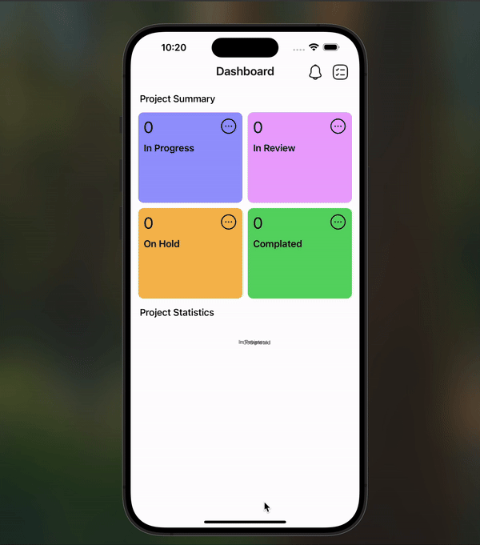
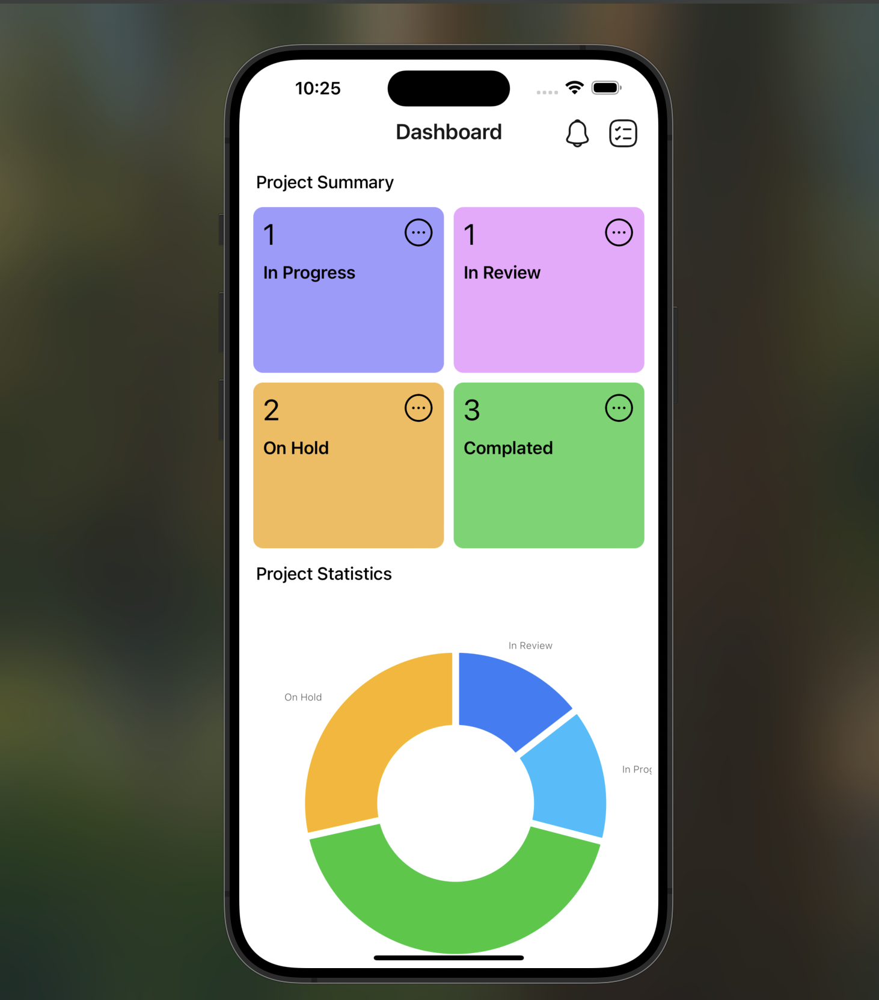
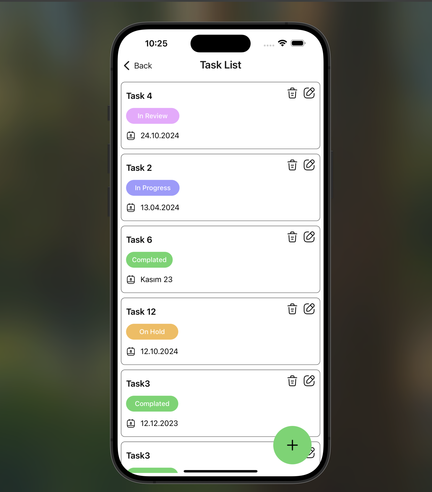
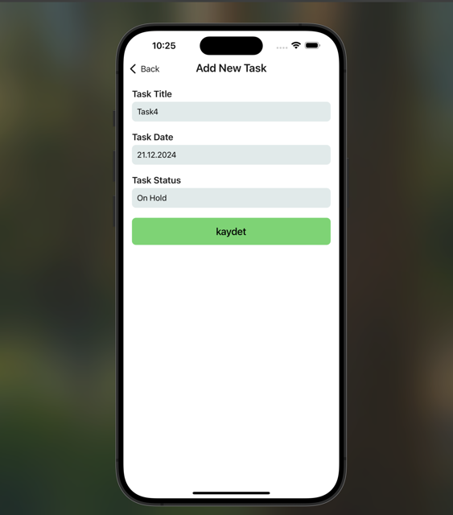

# Task Management Application

## Overview

This is a Task Management Application built using React Native and Redux for state management. The app allows users to create, update, delete, and manage tasks efficiently. It features a clean and user-friendly interface optimized for mobile devices.

## Screenshots 🖼️

### Video GIF



### Dashboard



### Tasks



### AddTask



## Features

- Add Task: Users can add new tasks with a title, date, and status.
- View Tasks: Displays a list of tasks with details such as title, date, and status.
- Edit Task: Allows users to update task information.
- Delete Task: Users can delete tasks with a confirmation prompt.
- Task Status Indicator: Each task has a status (e.g., InProgress, Completed) highlighted with different colors.
- Navigation: Seamless navigation between screens using React Navigation.
- State Management: Utilizes Redux for managing the application's global state.
  ## Tech Stack

- React Native: For building the mobile application.
- Redux: For state management.
- React Navigation: For screen navigation.
- Iconsax: For icons and visual enhancements.
- react-native-svg
- victory-native :For charts

## Screens

- Dashboard: Displays an overview and navigation options for the app.
- Task List: Shows a list of all tasks.
- Add Task: Allows users to create a new task.
- Update Task: Enables users to edit an existing task.

## How to Run the Project

## Installation

Follow these steps to run the project on your local machine:

Clone the Repository:

```
git clone https://github.com/ozerbaykal/musemind-redux.git
```

Navigate to the Project Directory:

```
cd musemind-redux
```

Install Dependencies:

```
npm install

# or

yarn install
```

Start the Metro Bundler:

```
npx react-native start
```

Run the Application:

For iOS:

```
npx react-native run-ios
```

For Android:

```
npx react-native run-android
```

## Contributing

Contributions are welcome! Please open an issue first to discuss what you would like to change.

- 1.Fork the project
- 2.Create your feature branch (git checkout -b feature/NewFeature)
- 3.Commit your changes (git commit -m 'Add new feature')
- 4.Push to the branch (git push origin feature/NewFeature)
- 5.Open a Pull Request

## Contact 📬

**Özer BAYKAL**  
Email: [baykalozer87@gmail.com](mailto:baykalozer87@gmail.com)  
Project Link: [musemind-redux](https://github.com/ozerbaykal/musemind-redux)
